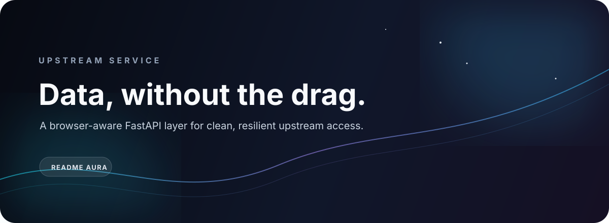

<p align="center"></p>
<p align="center"><a href="https://github.com/Shoislam0311/miruro-api-v3">Source</a>&nbsp;&nbsp;·&nbsp;&nbsp;<a href="CONTRIBUTION.md">Contribution guide</a>&nbsp;&nbsp;·&nbsp;&nbsp;<a href="Dockerfile">Container</a></p>

> A compact API layer for asynchronous, browser-aware upstream retrieval.

## What it does

Miruro API v3 wraps upstream media access behind a small FastAPI service. It combines async HTTP tooling, browser-like request support, and container-friendly runtime behavior so consumers can work with one consistent service boundary.

## The pipeline

```text
Client request
      │
      ▼
FastAPI + Uvicorn
      │
      ├── HTTPX / curl_cffi
      ├── ViperTLS + Chromium support
      └── normalized upstream response
```

## Stack signal

| Layer | Choice |
|:--|:--|
| Runtime | Python 3.12 |
| API | FastAPI |
| Server | Uvicorn |
| Requests | HTTPX, curl_cffi |
| Browser compatibility | ViperTLS and Chromium installation |
| Configuration | python-dotenv |
| Delivery | Docker with Railway/Render-compatible `PORT` handling |

## Start locally

```bash
python3.12 -m venv .venv
source .venv/bin/activate
pip install -r requirements.txt
./start.sh
```

The service reads `PORT` from the environment and defaults to `8080`. The Docker image installs the browser dependencies required by the ViperTLS path.

## Keep the edges safe

Upstream services have their own terms, limits, and content policies. Keep credentials out of Git, avoid unnecessary request volume, and read [CONTRIBUTION.md](CONTRIBUTION.md) before changing request behavior.

<p align="center"><sub>Small surface. Explicit boundaries. Fewer surprises.</sub></p>
